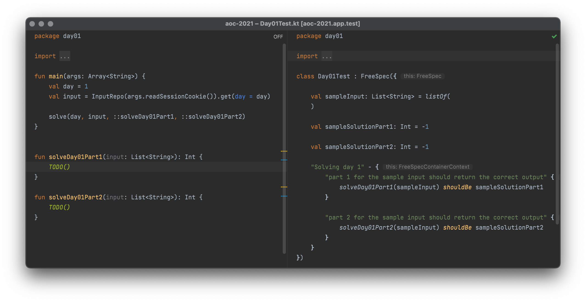

# Advent of Code Kotlin Template
A template which will help you concentrate on the puzzle solutions. It brings
* Downloading and caching of the puzzle input
* A place to enter your puzzle solving code. Results are printed and the time gets measured.
* Tests to check your puzzle solving code against the example data you get each day.

## Setup
* Click 'Use this template'
* Clone your new repository
* Open the project with IntelliJ Idea CE (recommended)

### Set up the automatic input download
The setup process differs depending on how you are planning to execute your solutions.
1. Via gradle from the command line
2. Via the run button in IntelliJ

Either way, you will have to determine your session cookie beforehand.

> The downloader tries to download the input for the current year. If you want to use this template for older puzzles you have to adjust it accordingly.

#### 0. Determine your session cookie
* Open [adventofcode.com](https://adventofcode.com) in your browser
* Login
* Open the developer tools
* Open the storage tab
* Select "Cookies" → "https://adventofcode.com"
* A table will open, the row with the name "session" is the correct one, the session cookie is the string in the "Value" field

#### 1. Via gradle from the command line
* Setup (only needed once)
  1. Create the file `./gradle.properties`
  2. Insert the line `sessionCookie=yourSessionCookieWithoutQuotes`
* Execution for a day
  * Execute `./gradlew run -Dday={day number}`

> Alternatively you could skip the setup and pass the cookie as a parameter: `./gradlew run -Dday={day number} -DsessionCookie={session cookie}"`

#### 2. Via the run button in IntelliJ
1. Open one of the `Day{XY}.kt` files
2. Click the play button next to the `main` function, select `Modify run configuration`
3. Insert your session cookie into the field `Program arguments`
4. Execute the day by clicking the run button again and select `Run`

You have to repeat this for each day. Or you edit your run configuration each day to execute a different main function.

## Tests
Tests are prepared. They are written with [KoTest](https://kotest.io/).  
Please make sure to install the KoTest IntelliJ Idea plugin from the plugin repository in the settings.  

Each day you can insert the given example data and solution into the according test class. Running the tests will check if your solution will result in the correct answer.

You can execute the tests with one of these options:
* Click the play button next to the test class or method (KoTest plugin required)
* Select and run the according run configuration
* Execute `./gradlew :app:test --tests "day{XY}.Day{XY}Test"`

If you want to write more tests along the way: 
* For KoTests API have a look into the [documentation](https://kotest.io/docs/framework/framework.html) and the list of [assertions](https://kotest.io/docs/assertions/assertions.html).
* If you need to mock something, [MockK](https://mockk.io/) is ready to go.
